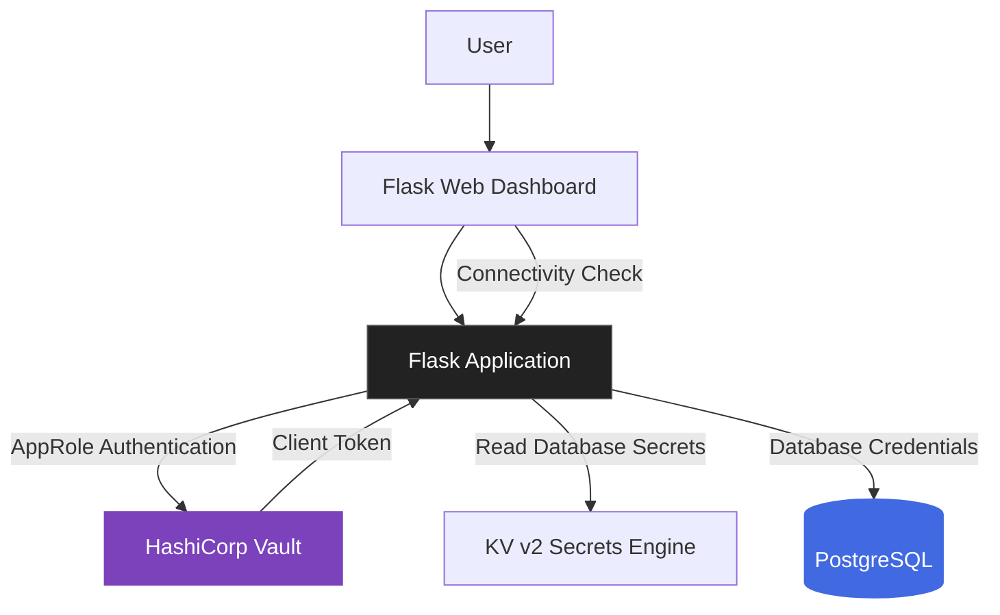
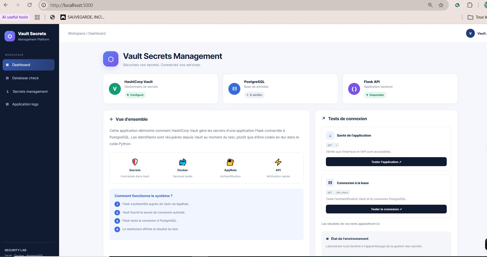
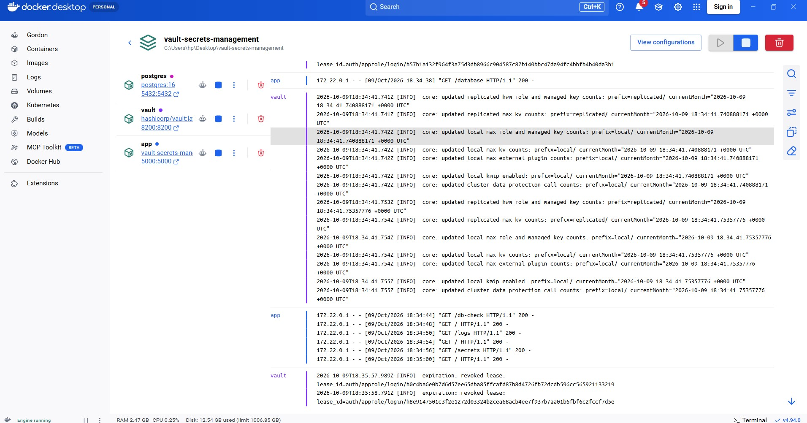

# 🔐 Vault Secrets Management Lab

<p align="center">
  <strong>Secure Secret Management with HashiCorp Vault, Docker, Flask & PostgreSQL</strong>
</p>

<p align="center">
  
  
  
  
</p>

## 📌 Overview

This project explores how **HashiCorp Vault can centralize secrets management** in a containerized application environment.

It demonstrates how a Flask application can authenticate with Vault using the **AppRole authentication method**, retrieve database credentials from a KV secrets engine, and connect to PostgreSQL without hardcoding database credentials directly into the application code.

The project also includes a web dashboard for exploring the environment, checking database connectivity, viewing secret-management information, and accessing container log instructions.

> 🎯 **Objective:** Understand how secrets management, application authentication, and database access can be integrated into a practical cybersecurity lab.

## 🏗️ Architecture


## 📸 Project Screenshots

### Dashboard




### Docker Environment



### 🔄 How It Works

1. **Containerized environment:** Docker Compose orchestrates Vault, Flask, and PostgreSQL.
2. **Application authentication:** Flask authenticates to Vault through AppRole using configured credentials.
3. **Secrets retrieval:** The application reads database credentials from a KV v2 secrets path.
4. **Database connection:** Flask uses the retrieved credentials to connect to PostgreSQL.
5. **Web dashboard:** Users can explore the application, check database connectivity, and navigate the available sections.

## 🛡️ Security Concepts Demonstrated

| Concept                             | Implementation                                 |
| ----------------------------------- | ---------------------------------------------- |
| Centralized secrets management      | HashiCorp Vault                                |
| Application authentication          | AppRole                                        |
| Secrets storage                     | KV v2 secrets engine                           |
| Database credential management      | Vault-managed credentials stored as KV secrets |
| Container isolation                 | Docker Compose                                 |
| Access control                      | Vault policies                                 |
| Application-to-database integration | Flask and PostgreSQL                           |

**Important distinction:** This lab stores database credentials in a KV secrets engine. It does not currently demonstrate Vault's dynamic database secrets engine or automatic credential rotation.

## ✨ Features

* 🖥️ **Web Dashboard** — A simple interface for navigating the lab.
* 🔐 **Secrets Management** — Integration with Vault for retrieving database credentials.
* 🗄️ **Database Connectivity** — PostgreSQL connection checks.
* 📦 **Containerized Services** — A reproducible local environment using Docker Compose.
* 📋 **Vault Policy** — A policy file defining the application's permitted Vault access.
* 📝 **Logs Guidance** — Instructions for inspecting container logs during troubleshooting.

## 🧰 Technology Stack

* **Secrets management:** HashiCorp Vault
* **Authentication:** Vault AppRole
* **Secrets engine:** KV v2
* **Backend:** Python, Flask
* **Database:** PostgreSQL
* **Containerization:** Docker, Docker Compose
* **Frontend:** HTML, CSS
* **Version control:** Git, GitHub

## 📂 Project Structure

```text
vault-secrets-management/
├── app/
│   ├── templates/
│   │   ├── index.html
│   │   ├── database.html
│   │   ├── secrets.html
│   │   └── logs.html
│   ├── app.py
│   ├── Dockerfile
│   └── requirements.txt
├── vault/
│   └── app-policy.hcl
├── .env.example
├── .gitignore
├── docker-compose.yml
└── README.md
```

## 🚀 Getting Started

### Prerequisites

Install the following tools before running the lab:

* [Docker Desktop](https://www.docker.com/products/docker-desktop/)
* [Git](https://git-scm.com/)
* A GitHub account to clone the repository

### 1. Clone the Repository

```bash
git clone https://github.com/asmamasrafi/vault-secrets-management.git
cd vault-secrets-management
```

### 2. Configure Environment Variables

Create your local environment file from the example:

```bash
cp .env.example .env
```

On Windows PowerShell, you can use:

```powershell
Copy-Item .env.example .env
```

Review `.env.example` and configure the required values in `.env` according to the project's configuration.

**Never commit your `.env` file or publish real credentials.**

### 3. Start the Environment

Build the Flask image and start the services:

```bash
docker compose up --build -d
```

Check the running containers:

```bash
docker compose ps
```

### 4. Access the Services

When the containers are running and the ports are configured as expected, open:

| Service         | Local URL             |
| --------------- | --------------------- |
| Flask Dashboard | http://localhost:5000 |
| Vault UI / API  | http://localhost:8200 |

The Vault development environment is intended for local learning and testing only.

### 5. Explore the Dashboard

Use the dashboard to explore the available sections:

* **Home:** Overview of the project.
* **Database:** Check database connectivity.
* **Secrets:** Explore the application's Vault integration.
* **Logs:** Find commands for inspecting container logs.

### 6. Inspect Container Logs

To inspect all service logs:

```bash
docker compose logs
```

To follow logs in real time:

```bash
docker compose logs -f
```

To inspect an individual service, use the corresponding service name from `docker-compose.yml`:

```bash
docker compose logs -f vault
```

Press `Ctrl+C` to stop following the logs.

### 7. Stop the Environment

```bash
docker compose down
```

Review the Compose configuration before removing volumes or persistent data.

## ⚠️ Security Considerations

This project is a **learning lab, not a production-ready deployment**.

* Vault development mode is not suitable for production.
* The development root token must never be reused in a real environment.
* Keep credentials in local environment configuration rather than hardcoding them in source files.
* Never commit `.env`, real tokens, passwords, or other sensitive material.
* Use least-privilege Vault policies for application access.
* Production deployments require appropriate Vault initialization, unsealing, durable storage, TLS, access controls, audit logging, and secure credential lifecycle management.
* Database credentials stored in KV v2 are static secrets unless additional mechanisms are implemented.

## 🔭 Future Improvements

Potential extensions for this lab include:

* [ ] Enable Vault audit logging and investigate authentication events.
* [ ] Introduce dynamic PostgreSQL credentials through Vault's database secrets engine.
* [ ] Explore short-lived credentials and automated rotation.
* [ ] Improve the dashboard's monitoring and error reporting.
* [ ] Add automated integration tests.
* [ ] Replace development-mode Vault with a properly secured deployment configuration.
* [ ] Integrate monitoring and security alerting.

## 📚 Learning Outcomes

Through this project, I explored:

* How applications authenticate to HashiCorp Vault.
* How AppRole can support machine-to-machine authentication.
* How KV v2 stores and retrieves application secrets.
* How a backend application can retrieve credentials at runtime.
* How Docker Compose brings multiple services together.
* Why centralized secrets management is an important part of application security.

## 👩‍💻 Author

**Assma Masrafi**
Cybersecurity Engineering Student | ENSA Agadir, Morocco

* GitHub: [@asmamasrafi](https://github.com/asmamasrafi)
* Project: [Vault Secrets Management Lab](https://github.com/asmamasrafi/vault-secrets-management)

---

<p align="center">
  <i>Learning by building, securing, and documenting real-world-inspired cybersecurity labs.</i>
</p>
