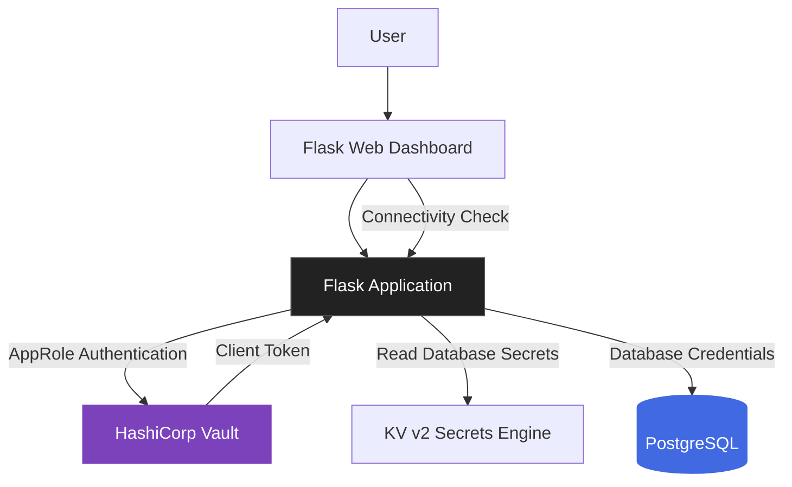

# 🔐 Vault Secrets Management Lab

<p align="center">
  <strong>Secure Secret Management with HashiCorp Vault, Docker, Flask & PostgreSQL</strong>
</p>

<p align="center">
  
  
  
  
</p>

## 📌 Overview

This project explores how **HashiCorp Vault can centralize secrets management** in a containerized application environment.

It demonstrates how a Flask application can authenticate with Vault using the **AppRole authentication method**, retrieve database credentials from a KV v2 secrets engine, and connect to PostgreSQL without hardcoding database credentials in the application code.

The project also includes a web dashboard for exploring the environment, checking database connectivity, viewing secret-management information, and accessing container log instructions.

> 🎯 **Objective:** Understand how secrets management, application authentication, and database access can be integrated into a practical cybersecurity lab.

> ⚠️ **Scope:** This is a learning lab, not a production deployment. See [Security Considerations](#️-security-considerations).

## 🏗️ Architecture



## 📸 Project Screenshots

### Dashboard


### Docker Environment


## 🔄 How It Works

1. **Containerized environment:** Docker Compose runs Vault, Flask, and PostgreSQL.
2. **Provisioning:** the secret, the policy, and the AppRole are created in Vault with CLI commands (see [Vault Provisioning](#-vault-provisioning)).
3. **Application authentication:** Flask authenticates to Vault through AppRole using the `role_id` and `secret_id` supplied in `.env`.
4. **Secrets retrieval:** the application reads database credentials from the KV v2 path `secret/vaultapp/db`.
5. **Database connection:** Flask uses the retrieved credentials to connect to PostgreSQL.
6. **Web dashboard:** users can check database connectivity and navigate the available sections.

## 🛡️ Security Concepts Demonstrated

| Concept                             | Implementation                                            |
| ----------------------------------- | --------------------------------------------------------- |
| Centralized secrets management      | HashiCorp Vault                                           |
| Application authentication          | AppRole (token TTL 1h, max TTL 4h)                        |
| Secrets storage                     | KV v2 secrets engine                                      |
| Database credential management      | Credentials stored as static KV secrets                   |
| Least-privilege access              | Vault policy granting `read` on a single secret path      |
| Reproducible environment            | Docker Compose (Vault, PostgreSQL, Flask)                 |
| Application-to-database integration | Flask and PostgreSQL                                      |

**Important distinction:** this lab stores database credentials in a KV secrets engine. It does not demonstrate Vault's dynamic database secrets engine or automatic credential rotation.

## ✨ Features

* 🖥️ **Web Dashboard** — a simple interface for navigating the lab.
* 🔐 **Secrets Management** — integration with Vault to retrieve database credentials.
* 🗄️ **Database Connectivity** — PostgreSQL connection check.
* 📦 **Containerized Services** — a reproducible local environment using Docker Compose.
* 📋 **Vault Policy** — a policy file (`vault/app-policy.hcl`) defining the application's permitted access.
* 📝 **Logs Guidance** — instructions for inspecting container logs.

## 🧰 Technology Stack

* **Secrets management:** HashiCorp Vault (dev mode)
* **Authentication:** Vault AppRole
* **Secrets engine:** KV v2
* **Backend:** Python, Flask
* **Database:** PostgreSQL 16
* **Containerization:** Docker, Docker Compose
* **Frontend:** HTML, CSS
* **Version control:** Git, GitHub

## 📂 Project Structure

```text
vault-secrets-management/
├── app/
│   ├── templates/
│   │   ├── index.html
│   │   ├── database.html
│   │   ├── secrets.html
│   │   └── logs.html
│   ├── app.py
│   ├── Dockerfile
│   └── requirements.txt
├── screenshots/
├── vault/
│   └── app-policy.hcl
├── .env.example
├── .gitignore
├── docker-compose.yml
└── README.md
```

## 🚀 Getting Started

### Prerequisites

* [Docker Desktop](https://www.docker.com/products/docker-desktop/)
* [Git](https://git-scm.com/)

### 1. Clone the repository

```bash
git clone https://github.com/asmamasrafi/vault-secrets-management.git
cd vault-secrets-management
```

### 2. Create your local environment file

```bash
cp .env.example .env
```

On Windows PowerShell:

```powershell
Copy-Item .env.example .env
```

The `role_id` and `secret_id` values are filled in at step 4. **Never commit `.env`.**

### 3. Start Vault and PostgreSQL

```bash
docker compose up -d vault postgres
docker compose ps
```

### 4. Provision Vault

Follow [Vault Provisioning](#-vault-provisioning), then put the generated `role_id` and `secret_id` in your local `.env`.

### 5. Start the Flask application

```bash
docker compose up -d --build app
docker compose ps
```

### 6. Access the services

| Service         | Local URL               |
| --------------- | ----------------------- |
| Flask Dashboard | <http://localhost:5000> |
| Vault UI / API  | <http://localhost:8200> |

### 7. Explore the dashboard

* **Home:** overview of the project.
* **Database:** check database connectivity.
* **Secrets:** explore the application's Vault integration.
* **Logs:** commands for inspecting container logs.

## 🔧 Vault Provisioning

Vault runs in **dev mode with in-memory storage**: everything below is lost when the Vault container restarts and must be repeated.

In dev mode Vault serves plain HTTP, so every CLI command run inside the container needs `VAULT_ADDR=http://127.0.0.1:8200`, otherwise it fails with an HTTPS error. The commands below use the dev root token (`root`), for this lab only.

The examples use PowerShell syntax.

**1. Store the database secret** (demo values; the password must match `POSTGRES_PASSWORD` in `docker-compose.yml`)

```powershell
docker exec -e VAULT_ADDR=http://127.0.0.1:8200 -e VAULT_TOKEN=root vault-server vault kv put secret/vaultapp/db username="vaultapp" password="demo_password" database="vaultapp"
```

**2. Load the least-privilege policy**

```powershell
Get-Content .\vault\app-policy.hcl -Raw | docker exec -i -e VAULT_ADDR=http://127.0.0.1:8200 -e VAULT_TOKEN=root vault-server vault policy write flask-policy -
```

On Linux/macOS: `docker exec -i -e VAULT_ADDR=http://127.0.0.1:8200 -e VAULT_TOKEN=root vault-server vault policy write flask-policy - < vault/app-policy.hcl`

The policy grants only `read` on `secret/data/vaultapp/db`:

```hcl
path "secret/data/vaultapp/db" {
  capabilities = ["read"]
}
```

Check it:

```powershell
docker exec -e VAULT_ADDR=http://127.0.0.1:8200 -e VAULT_TOKEN=root vault-server vault policy read flask-policy
```

**3. Enable AppRole and create the application role**

```powershell
docker exec -e VAULT_ADDR=http://127.0.0.1:8200 -e VAULT_TOKEN=root vault-server vault auth enable approle

docker exec -e VAULT_ADDR=http://127.0.0.1:8200 -e VAULT_TOKEN=root vault-server vault write auth/approle/role/flask-app token_policies="flask-policy" token_ttl="1h" token_max_ttl="4h"
```

**4. Generate the credentials for the application**

```powershell
docker exec -e VAULT_ADDR=http://127.0.0.1:8200 -e VAULT_TOKEN=root vault-server vault read auth/approle/role/flask-app/role-id

docker exec -e VAULT_ADDR=http://127.0.0.1:8200 -e VAULT_TOKEN=root vault-server vault write -f auth/approle/role/flask-app/secret-id
```

Copy the two values into your local `.env`, using the variable names defined in `.env.example`. Never commit them or show them in screenshots.

## 📝 Inspecting Logs

```bash
docker compose logs
docker compose logs -f app
docker compose logs -f vault
```

Press `Ctrl+C` to stop following the logs.

## 🛑 Stopping the Environment

```bash
docker compose down
```

This keeps the PostgreSQL volume. Review the Compose configuration before removing volumes.

## ⚠️ Security Considerations

This project is a **learning lab, not a production-ready deployment**.

* All credentials in this repository are **demo values** (for example the PostgreSQL password in `docker-compose.yml` and the Vault dev root token `root`). Never reuse them in a real environment.
* The application does not hardcode database credentials: it retrieves them from Vault at runtime. The PostgreSQL container, however, is initialized with a demo password defined in `docker-compose.yml`.
* Vault runs in **dev mode with in-memory storage**: the secret, policy, and AppRole are lost whenever the Vault container restarts.
* The Vault (`8200`) and PostgreSQL (`5432`) ports are published on the host. Run this lab only on a trusted machine.
* AppRole credentials in `.env` are themselves secrets (the "secret zero" problem): Vault removes database passwords from the code but does not remove the need to protect this bootstrap credential.
* The `secret_id` generated in this lab has no expiration and unlimited uses. Production setups should use short-lived, limited-use SecretIDs delivered through a secure mechanism.
* Database credentials stored in KV v2 are static secrets unless additional mechanisms are implemented.
* Never commit `.env`, real tokens, or passwords.
* Production deployments require proper Vault initialization and unsealing, durable storage, TLS, access controls, audit logging, and secure credential lifecycle management.

## 🔭 Future Improvements

* [ ] Add a negative test showing that the application token cannot read other Vault paths.
* [ ] Script the Vault provisioning steps.
* [ ] Enable Vault audit logging and investigate authentication events.
* [ ] Introduce dynamic PostgreSQL credentials through Vault's database secrets engine.
* [ ] Use short-lived, limited-use SecretIDs and automated rotation.
* [ ] Bind published ports to `127.0.0.1` and avoid publishing PostgreSQL.
* [ ] Add automated integration tests.
* [ ] Replace dev-mode Vault with a secured deployment configuration.
* [ ] Integrate monitoring and security alerting.

## 📚 Learning Outcomes

Through this project, I explored:

* How applications authenticate to HashiCorp Vault.
* How AppRole supports machine-to-machine authentication.
* How KV v2 stores and retrieves application secrets.
* How a Vault policy enforces least privilege.
* How a backend application can retrieve credentials at runtime.
* How Docker Compose brings multiple services together.
* Why the bootstrap credential ("secret zero") remains a key challenge in secrets management.

## 👩‍💻 Author

**Assma Masrafi**
Cybersecurity Engineering Student | ENSA Agadir, Morocco

* GitHub: [@asmamasrafi](https://github.com/asmamasrafi)
* Project: [Vault Secrets Management Lab](https://github.com/asmamasrafi/vault-secrets-management)

---

<p align="center">
  <i>Learning by building, securing, and documenting real-world-inspired cybersecurity labs.</i>
</p>
